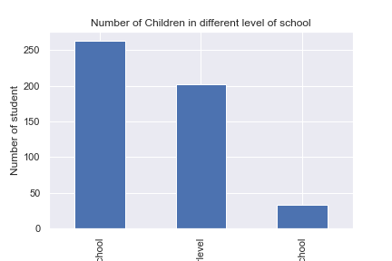

## Dataset
I will be using the dataset on grade found at kaggle with a license of Public Domain Dedication
[original website](https://www.kaggle.com/datasets/aljarah/xAPI-Edu-Data)
This is an educational data set which is collected from learning management system (LMS) called Kalboard 360. Kalboard 360 is a multi-agent LMS, which has been designed to facilitate learning through the use of leading-edge technology. Such system provides users with a synchronous access to educational resources from any device with Internet connection.
## Cleaning dataset
The dataset is already pretty clean, I delete all the duplicated rows and any row that contains the NULL value.
```python
df.drop_duplicates(inplace = True)
df.dropna(inplace = True)
```
 Moreover, the column headers is proper readable, I just add a name for the index column. 
```python
df.index.name = 'index'
```
I think that is enough for now, the further modification will be remained for later training part.
## Data visualizations 
First graph shows the data the the distribution of the grades that students in the class get. All the student are been separate in three level, 1 means student has the greatest behavior, 3 means the baddest.


Second graph shows the distribution of the grade that students comes from, all the tested students comes form low middle and high school.



Third graph shows the the evaluation of the parents to school. From this we can see if parents's attitude will affect students'behavior.


## Student behavior training
In this part, I need to choose 5 significant data as input of neural network. so I choose the absenceDays, Discussion, AnnouncementsView , VisITedResources, raisedhands. Those five feature will reflect if a student would like to participate in the class. In another word, if they do not like to participate during class, they would not like to get a great grade in this class. The output is final grade that the students get in this class. 
#### Splitting data
For splitting data, I just follow the usual practice, split 80% of whole dataset for training ,then 20% for testing.
#### model design
I choose the CNN model for training this data. since the first part is also doing a classification task. Firstly I copy the previous network see if can fit this dataset. and i find out with the previous network it can reach 60% accuracy, 
#### Hyper-parameter
On this basis, I did not change any hyper-parameter, all the hyper-parameters stay the same.
#### Accuracy 
After improve the hyper-parameter, the model can reach 77.4% for Train set, and 74% for Test set

## Data visualizaion


From those two figures, it is easy to see that most of the student who get high grade in class, are more like to participate in class, their interaction with class is much higher the student who get low grade in class. Although their are some special case that the student are not likely to participate in class but they can still get high grade or vice versa, but those student are minority. 

## Improvement model

Since in last I add one more convultion layer to help extract the feature, but in this model it seams can not make such modification, so i change the some hyper-parameter to imporve the accuracy of th model. I increase the learning rate and epochs 
```python
model.compile(optimizer=tf.keras.optimizers.Adam(learning_rate=0.005), loss='sparse_categorical_crossentropy', metrics=['accuracy'])
```
then increase the epochs to 50 to better learning the features of the dataset 
```python
model.fit(x_train, y_train, epochs=50, verbose=1)
```
Those two modification helps the model increase accuracy from 75% to 80%.