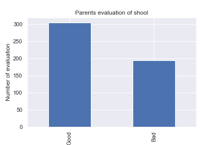

## Dataset
I will be using the dataset on grade found at kaggle with a license of Public Domain Dedication
[original website](https://www.kaggle.com/datasets/aljarah/xAPI-Edu-Data)
This is an educational data set which is collected from learning management system (LMS) called Kalboard 360. Kalboard 360 is a multi-agent LMS, which has been designed to facilitate learning through the use of leading-edge technology. Such system provides users with a synchronous access to educational resources from any device with Internet connection.
## Cleaning dataset
The dataset is already pretty clean, it does not have any inconsistent or missing data. Moreover, the column headers is proper readable. So i think the dataset does not need to further modification.
## Data visualizations 
First graph shows the data the the distribution of the grades that students in the class get. All the student are been separate into three level, 1 means student has the greatest behavior, 3 means the baddest.

Second graph shows the distribution of the grade that students comes from, all the tested students comes form low middle and high school.

Third graph shows the the evaluation of the parents to school. From this we can see if parents's attitude will affect students'behavior.

