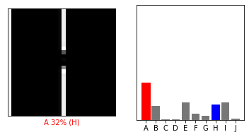
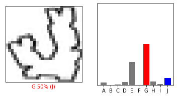
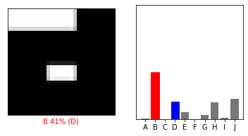
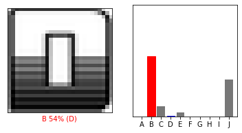
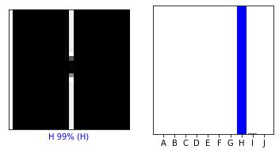
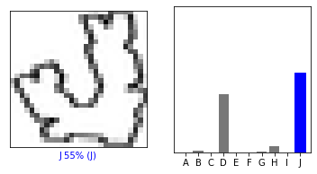
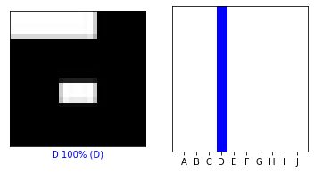
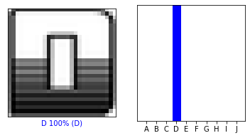

## Code changed in 3 files
```python
     model = tf.keras.models.load_model(sys.argv[2])
```
The first line I changed the none to load_model function and make it receive the input name as parameter.

```python
    prediction = model.predict(img)
```
I changed the second line to make the prediction of the input image that we input.
```python
    plot(class_names, prediction[0], true_label, predicted_label, img[0])
```
The third place that I change is that I check the result of the prediction var, find it is a 2d list, so I just take the first element as the parameter of the plot function.
## Partial model
This partial model use the exact same network as the network for MNIST dataset from part 1. It has one flatten layer and two Dense layers, each of them have the activation functions are relu and softmax, the model will going to learn 30 epochs and the learning rate is 0.001.  
## Wrong prediction
I found out that using old model to predict graph indexed 88 62 12 106 will give a worry prediction, which means it probably may be overfitted. The following graph shows the cases and their predicted label by Partial model.
Test 31

Test 62

Test 88

Test 108

## Improvement
I think it may caused by the I did not add one convolution layer to help extract the feature. So I add an Con2D layer to avoid over-fitted, I follow the usual practice to set kernel_size to be 5*5 and the filters to be 64
```python
    model.add(tf.keras.layers.Conv2D(filters = 64, kernel_size = (5,5),padding = 'Same', activation ='relu', input_shape = (28,28,1))) 
```
Then I found out the training speed is too slow, then I add another MaxPool2D layer to help decrease the calculation. The pool_size is usually set to 2*2. 
```python
    model.add(tf.keras.layers.MaxPool2D(pool_size=(2,2)))
```
In order to saving the training time, I decrease the epochs to 8
```python
    model.fit(x_train, y_train, epochs=8, verbose=1)
```
After that I keep the network to be same as the Partial model, which has two dense layers to do the classification work.

## result 
The following figures are the results that predicted by complete model.
Test 31

Test 62

Test 88

Test 108
